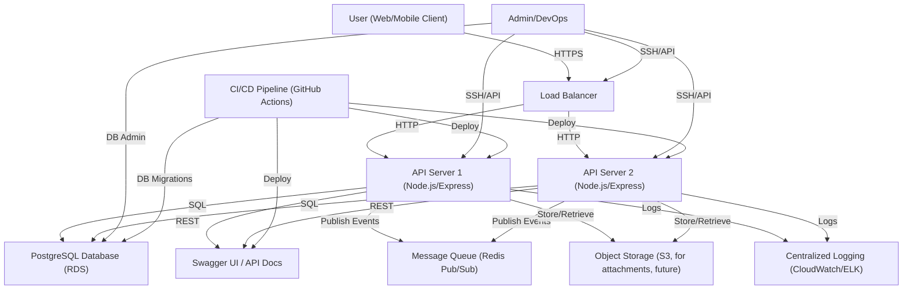
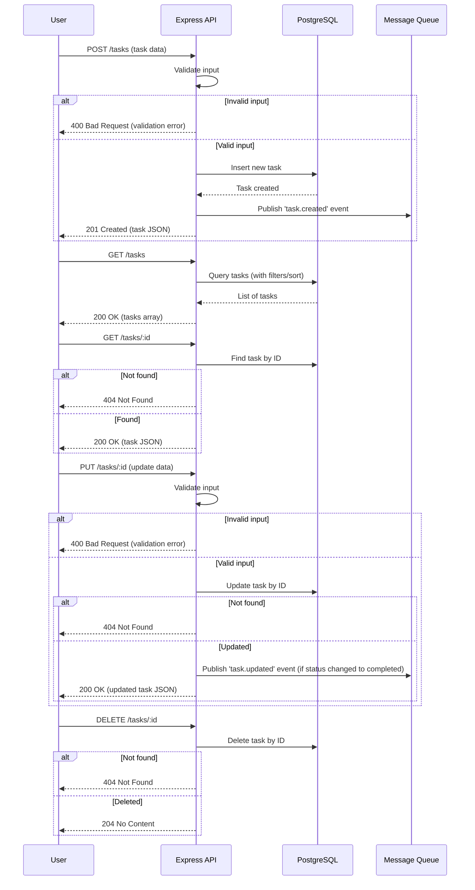

# Sterry Task Management Service

## System Design & Architecture

### System Diagram & Design Explanation



**Explanation:**
- Users interact with the system via web/mobile clients, routed through a load balancer for high availability.
- Multiple stateless API servers (Node.js/Express) handle requests, connect to a PostgreSQL database, and serve API docs.
- All write operations (create/complete task) publish events to a Redis-based message queue for decoupled, async processing (e.g., notifications, analytics).
- Centralized logging and CI/CD pipelines ensure reliability and maintainability.
- The architecture is cloud-ready, horizontally scalable, and supports future integrations (object storage, more queues, etc).

---

## Project Description & Setup

Sterry Task Management Service is a scalable, production-grade backend for managing tasks, designed for extensibility, reliability, and team collaboration.

### Features
- RESTful API for CRUD operations on tasks
- Filtering, sorting, and validation
- PostgreSQL for robust, relational data storage
- Redis Pub/Sub for event-driven architecture (mock notifications/analytics)
- Dockerized for easy local development and deployment
- Comprehensive tests (unit/integration)
- Interactive API docs (Swagger UI)
- Clean, maintainable codebase with clear separation of concerns

### Setup & Running Walkthrough

#### Prerequisites
- [Docker](https://www.docker.com/) and [Docker Compose](https://docs.docker.com/compose/)
- [Node.js](https://nodejs.org/) (for local dev/test, optional)

#### 1. Clone the repository
```sh
git clone <your-repo-url>
cd sterry
```

#### 2. Start the stack (API, DB, Redis)
```sh
docker-compose up --build
```
- API: http://localhost:3000
- Swagger UI: http://localhost:3000/docs
- PostgreSQL: localhost:5432 (user: sterryuser, pass: sterrypass)
- Redis: localhost:6379

#### 3. Run tests
```sh
npm install
npm test
```

#### 4. Generate code docs (JSDoc)
```sh
npx jsdoc src -r -d docs
```

#### 5. Example API usage
See [README.md](#advanced-api-usage-examples) and Swagger UI for detailed examples.

---

## Technology Choices & Rationale

| Component      | Choice                | Rationale                                                                 |
|---------------|-----------------------|--------------------------------------------------------------------------|
| Language      | Node.js (JavaScript)  | Fast prototyping, async I/O, large ecosystem, easy hiring                |
| Framework     | Express               | Minimal, flexible, widely adopted, great for REST APIs                   |
| Database      | PostgreSQL            | ACID compliance, relational modeling, scalability, open source           |
| ORM           | Sequelize             | Clean data modeling, migrations, validation, easy to switch DBs          |
| Message Queue | Redis Pub/Sub         | Simple, fast, easy for local dev, extensible to RabbitMQ/Kafka in prod   |
| Container     | Docker, Compose       | Consistent dev/prod environments, easy onboarding                        |
| Docs          | Swagger/OpenAPI, JSDoc| Industry standard, interactive, supports automation                      |
| Testing       | Jest, Supertest       | Modern, fast, supports both unit and integration testing                 |
| CI/CD         | GitHub Actions        | Automate tests, builds, deployments                                      |

**Why not ...?**
- NoSQL: Chose SQL for strong consistency and relational queries
- Monolith: API is stateless and ready for microservices if needed
- RabbitMQ/Kafka: Redis is simpler for local/mock, can swap for prod

---

## Scaling for Large Volumes

- **Stateless API servers:** Easily scale horizontally behind a load balancer
- **Database:** Use managed PostgreSQL (e.g., AWS RDS), enable read replicas, partitioning, and connection pooling
- **Queue:** Swap Redis for RabbitMQ/Kafka for high-throughput, persistent messaging
- **Caching:** Add Redis/Memcached for hot data
- **Object storage:** Use S3 for file/attachment scalability
- **Monitoring:** Centralized logging, metrics, and alerting (CloudWatch, ELK, Prometheus)
- **CI/CD:** Automated tests, builds, and blue/green deployments
- **API Gateway:** For rate limiting, auth, and traffic shaping

---

## Team Responsibility Split

| Role                | Responsibilities                                                      |
|---------------------|-----------------------------------------------------------------------|
| Backend Lead        | System architecture, API design, code reviews, deployment strategy     |
| Backend Engineer    | API implementation, DB modeling, integration, testing                 |
| DevOps Engineer     | Docker, CI/CD, environment variables, secrets, monitoring             |
| QA Engineer         | Automated and manual testing, test case design, edge case validation  |
| Documentation Lead  | OpenAPI/Swagger, JSDoc, onboarding guides, API usage examples         |

- **Leadership:** Backend Lead ensures architectural vision, code quality, and team alignment
- **Collaboration:** Engineers work in feature squads, use PRs and code reviews
- **Ownership:** Each role has clear deliverables and cross-functional support

---

## Assumptions & Limitations

- **Authentication/Authorization:** Not implemented (would use JWT/OAuth in production)
- **Email/Notification:** Mocked via console logs; real integration would use external services
- **File Uploads:** S3/object storage integration is planned, not implemented
- **Queue Durability:** Redis Pub/Sub is non-durable; for production, use RabbitMQ/Kafka
- **Single Region:** Multi-region failover not implemented, but architecture supports it
- **API Gateway/Security:** Not included, but recommended for production
- **Data Volume:** Designed for thousands of users; can scale further with above strategies

---

For any questions or further architectural deep-dives, see the codebase, Swagger UI, or contact the project lead.

## How to Read the Docs

- **Interactive API Docs:**
  - Run the app and visit [http://localhost:3000/docs](http://localhost:3000/docs) for live Swagger UI documentation.
- **OpenAPI Spec:**
  - See [openapi.yaml](./openapi.yaml) for the full OpenAPI 3.0 spec.
  - You can import this file into [Swagger Editor](https://editor.swagger.io/) to explore and test the API interactively.
- **Code-level Docs (JSDoc):**
  - All controller functions are documented with JSDoc comments for clarity and maintainability.

## API Sequence Diagram (CRUD, Validation, MQ)



## How to Generate JSDoc HTML

1. Install JSDoc (if not already):
   ```sh
   npm install --save-dev jsdoc
   ```
2. Generate HTML documentation:
   ```sh
   npx jsdoc src -r -d docs
   ```
3. Open `docs/index.html` in your browser to view the generated documentation.

## Example API Usage

### Create a Task
**POST /tasks**
```json
{
  "title": "Write documentation",
  "description": "Document the API using OpenAPI and JSDoc.",
  "dueDate": "2025-01-01",
  "status": "open"
}
```

### Get All Tasks
**GET /tasks?status=open&sortBy=title&sortOrder=asc**

### Get a Task by ID
**GET /tasks/b1a2c3d4-e5f6-7890-abcd-1234567890ef**

### Update a Task
**PUT /tasks/b1a2c3d4-e5f6-7890-abcd-1234567890ef**
```json
{
  "title": "Update docs",
  "status": "completed"
}
```

### Delete a Task
**DELETE /tasks/b1a2c3d4-e5f6-7890-abcd-1234567890ef**

### Error Example
**POST /tasks** (missing title)
```json
{
  "description": "No title provided"
}
```
**Response:**
```json
{
  "errors": [
    {
      "msg": "Title is required",
      "param": "title"
    }
  ]
}
```

See the OpenAPI spec for full details on all endpoints, parameters, and responses.

## Message Queue Integration

This project integrates a message queue using **Redis Pub/Sub** to simulate real-world event-driven architecture. The queue is used to:
- Send a notification when a task is created or completed
- Offload email or analytics events (mocked as console logs)

### Why Redis?
- Simple and fast for local development
- No extra dependencies or setup beyond Docker Compose
- Pub/Sub pattern is easy to extend for real-world use (e.g., RabbitMQ, Kafka)

### Queue Structure
- **Channel:** `task.events`
- **Event Types:**
  - `task.created` — published after a new task is created
  - `task.completed` — published after a task is marked as completed
- **Payload:** The full task object (as JSON)

### Example Event Payload
```json
{
  "type": "task.created",
  "payload": {
    "id": "b1a2c3d4-e5f6-7890-abcd-1234567890ef",
    "title": "Write documentation",
    "description": "Document the API using OpenAPI and JSDoc.",
    "dueDate": "2025-01-01T00:00:00.000Z",
    "status": "open"
  }
}
```

### How the Mock Works
- The app publishes events to the `task.events` channel using Redis.
- A subscriber listens to this channel and logs all events to the console.
- In a real system, this could trigger emails, push notifications, analytics, or integrations with other services.

### How to Extend
- Replace Redis with RabbitMQ or Kafka for production scalability.
- Add real consumers for notifications, emails, or analytics.
- Add more event types (e.g., `task.deleted`, `task.updated`). 