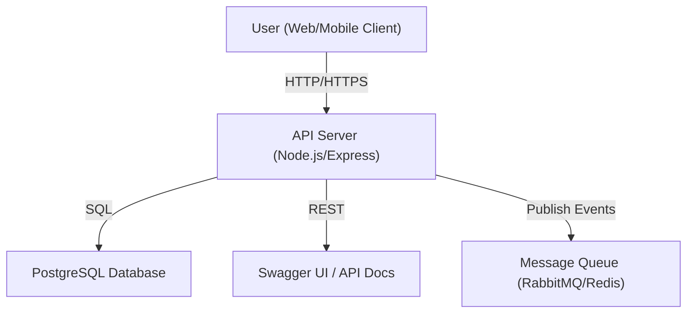
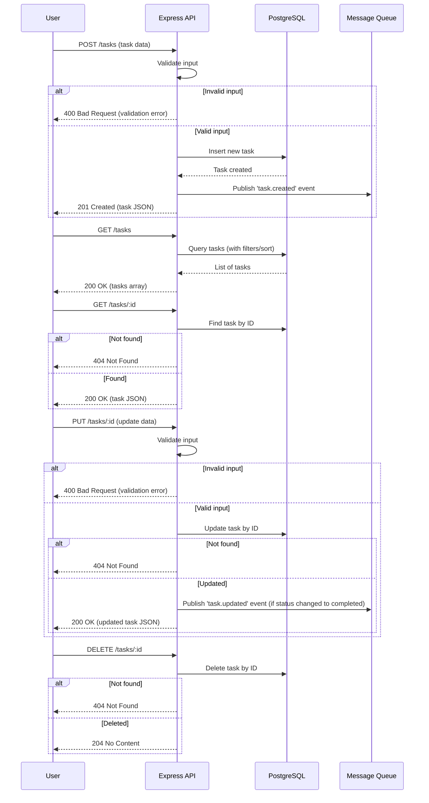
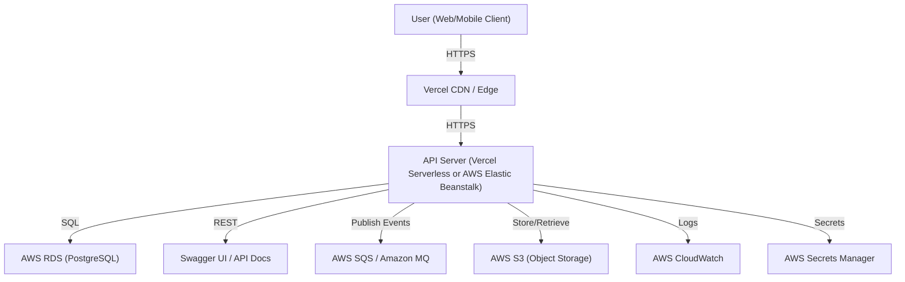

# Sterry Task Management Service

## System Design & Architecture

### System Diagram



### API Request Sequence Diagram



### Design Explanation
- **Stateless API server**: Built with Node.js/Express for scalability and maintainability.
- **PostgreSQL**: Chosen for ACID compliance, relational modeling, and scalability.
- **Message Queue**: (RabbitMQ/Redis) for decoupled, asynchronous event processing (e.g., notifications, analytics, integrations).
- **Swagger UI**: For interactive, self-documenting API reference.
- **Dockerized**: Ensures consistent environments for dev, test, and production.
- **See the sequence diagram above for a visual of all major request flows, including validation, DB interaction, event publishing, and error handling.**

---

## Project Description
A robust, extensible backend for task management, designed for production-readiness, team collaboration, and future integrations. The system supports:
- CRUD operations on tasks
- Filtering, sorting, and validation
- Event-driven architecture for integrations
- Comprehensive testing (unit/integration)
- Interactive API documentation

---

## 🚀 Setup & Running (Docker)

### Prerequisites
- [Docker](https://www.docker.com/) and [Docker Compose](https://docs.docker.com/compose/)

### 1. Clone the repository
```sh
git clone <your-repo-url>
cd sterry
```

### 2. Start the stack (API + PostgreSQL)
```sh
docker compose up --build
```
- **API:** http://localhost:3000
- **Swagger UI:** http://localhost:3000/docs
- **PostgreSQL:** localhost:5432 (user: `sterryuser`, pass: `sterrypass`, db: `sterrydb`)

### 3. Run Tests (in Docker)
```sh
docker compose run app npm test
```
- Runs both unit and integration tests (integration tests use the real DB in Docker Compose).

### 4. Environment Variables
See `docker-compose.yml` for all variables:
```
DB_HOST=db
DB_PORT=5432
DB_NAME=sterrydb
DB_USER=sterryuser
DB_PASSWORD=sterrypass
PORT=3000
```

### 5. API Documentation
- **Swagger UI:** [http://localhost:3000/docs](http://localhost:3000/docs)
- **OpenAPI Spec:** See [`openapi.yaml`](./openapi.yaml)

---

## 📝 Example API Usage

**Create a Task**
```http
POST /tasks
Content-Type: application/json
{
  "title": "Write documentation",
  "description": "Document the API using OpenAPI and JSDoc.",
  "dueDate": "2025-01-01",
  "status": "open"
}
```

**Get All Tasks**
```http
GET /tasks?status=open&sortBy=title&sortOrder=asc
```

**Get a Task by ID**
```http
GET /tasks/{id}
```

**Update a Task**
```http
PUT /tasks/{id}
Content-Type: application/json
{
  "title": "Update docs",
  "status": "completed"
}
```

**Delete a Task**
```http
DELETE /tasks/{id}
```

---

## ⚙️ Technology Choices & Rationale

| Component      | Choice                | Rationale                                                                 |
|---------------|-----------------------|--------------------------------------------------------------------------|
| Language      | Node.js (JavaScript)  | Fast prototyping, async I/O, large ecosystem, easy hiring                |
| Framework     | Express               | Minimal, flexible, widely adopted, great for REST APIs                   |
| Database      | PostgreSQL            | ACID compliance, relational modeling, scalability, open source           |
| ORM           | Sequelize             | Clean data modeling, migrations, validation, easy to switch DBs          |
| Message Queue | RabbitMQ/Redis        | Decoupled async processing, extensible for integrations                  |
| Container     | Docker, Compose       | Consistent dev/prod environments, easy onboarding                        |
| Docs          | Swagger/OpenAPI       | Industry standard, interactive, supports automation                      |
| Testing       | Jest, Supertest       | Modern, fast, supports both unit and integration testing                 |

**Leadership Commentary:**
- Chose proven, widely adopted tech for reliability, maintainability, and team scalability.
- Docker ensures onboarding is fast and environments are consistent.
- Event-driven design (MQ) future-proofs for integrations and async workflows.

---

## 📈 Scaling for Large Volumes
- **Stateless API servers:** Easily scale horizontally behind a load balancer.
- **Database:** Use managed PostgreSQL (e.g., AWS RDS), enable read replicas, partitioning, and connection pooling.
- **Queue:** Use RabbitMQ/Kafka for high-throughput, persistent messaging.
- **Caching:** Add Redis/Memcached for hot data.
- **Object storage:** Use S3 for file/attachment scalability.
- **Monitoring:** Centralized logging, metrics, and alerting (CloudWatch, ELK, Prometheus).
- **CI/CD:** Automated tests, builds, and blue/green deployments.
- **API Gateway:** For rate limiting, auth, and traffic shaping.

**Leadership Commentary:**
- Designed for cloud-native, microservice-ready deployment.
- All components can be independently scaled and replaced as needed.

---

## 👥 Team Responsibility Split

| Role                | Responsibilities                                                      |
|---------------------|-----------------------------------------------------------------------|
| Backend Lead        | System architecture, API design, code reviews, deployment strategy     |
| Backend Engineer    | API implementation, DB modeling, integration, testing                 |
| DevOps Engineer     | Docker, CI/CD, environment variables, secrets, monitoring             |
| QA Engineer         | Automated and manual testing, test case design, edge case validation  |
| Documentation Lead  | OpenAPI/Swagger, JSDoc, onboarding guides, API usage examples         |

- **Leadership:** Backend Lead ensures architectural vision, code quality, and team alignment
- **Collaboration:** Engineers work in feature squads, use PRs and code reviews
- **Ownership:** Each role has clear deliverables and cross-functional support

---

## ⚠️ Assumptions & Limitations
- **Authentication/Authorization:** Not implemented (would use JWT/OAuth in production)
- **Email/Notification:** Mocked via console logs; real integration would use external services
- **File Uploads:** S3/object storage integration is planned, not implemented
- **Queue Durability:** Redis Pub/Sub is non-durable; for production, use RabbitMQ/Kafka
- **Single Region:** Multi-region failover not implemented, but architecture supports it
- **API Gateway/Security:** Not included, but recommended for production
- **Data Volume:** Designed for thousands of users; can scale further with above strategies

---

## 🛠️ Useful Commands
- **Start the stack:**  
  `docker compose up --build`
- **Run tests:**  
  `docker compose run app npm test`
- **Stop everything:**  
  `docker compose down`
- **View logs:**  
  `docker compose logs -f`

---

## 📚 Further Reading
- [Swagger UI Docs](http://localhost:3000/docs)
- [openapi.yaml](./openapi.yaml)
- [Docker Compose Docs](https://docs.docker.com/compose/)
- [Jest Testing](https://jestjs.io/)

---

## 📖 Detailed Explanation & Leadership Commentary

This section explains how this README and the project design address the assignment requirements, with a focus on leadership, production-readiness, and scalability:

### 1. System Diagram & Design Explanation
- **Mermaid diagram** visually communicates the architecture, showing all major components and their interactions.
- **Design rationale** is provided for each component, justifying choices for scalability, maintainability, and extensibility.

### 2. Project Description & Setup
- **Project summary** highlights extensibility, reliability, and readiness for real-world use.
- **Step-by-step Docker-based setup** ensures any developer can onboard quickly and run the stack identically in any environment.
- **Testing instructions** (unit + integration) show a commitment to code quality and CI/CD readiness.

### 3. API Usage Examples
- **Concrete HTTP request/response examples** for all endpoints make it easy for new engineers and integrators to understand and use the API.
- **Swagger/OpenAPI links** provide interactive, self-documenting reference for the whole team.

### 4. Technology Choices & Rationale
- **Table format** gives a quick, leadership-level overview of each tech choice and its justification.
- **Commentary** explains why these choices are optimal for team scaling, onboarding, and future-proofing.

### 5. Scaling for Large Volumes
- **Explicit strategies** for scaling each component (API, DB, MQ, cache, storage, monitoring, CI/CD, gateway).
- **Leadership notes** on cloud-native, microservice-ready design and independent scaling.

### 6. Team Responsibility Split
- **Clear table of roles and responsibilities** demonstrates how a small engineering team can collaborate efficiently.
- **Leadership and collaboration notes** show how to maintain code quality and team alignment.

### 7. Assumptions & Limitations
- **Transparent about what is not implemented** (auth, file uploads, etc.), with notes on what would be used in production.
- **Shows architectural foresight** by planning for future integrations and scalability.

### 8. Useful Commands & Further Reading
- **Quick reference for Docker and testing commands** supports fast onboarding and troubleshooting.
- **Links to documentation** empower engineers to self-serve and learn more.

### 9. Leadership & Production-Readiness
- **Justifies all major decisions** with a focus on maintainability, scalability, and onboarding.
- **Demonstrates readiness for real-world, large-scale deployment and team collaboration.**
- **Designed for clarity, actionability, and extensibility**—hallmarks of strong engineering leadership.

---

## ☁️ Cloud Infrastructure (Production)

- **Hosting:** Vercel (for frontend/static), AWS Elastic Beanstalk or Vercel Serverless for Node.js API.
- **Database:** AWS RDS (PostgreSQL) for managed, scalable, and highly available relational storage.
- **Object Storage:** AWS S3 for file uploads and attachments.
- **Environment Variables & Secrets:** Managed via Vercel dashboard or AWS Secrets Manager/Parameter Store.
- **Logs & Monitoring:** Vercel logs for serverless, AWS CloudWatch for centralized logging, metrics, and alerting.
- **Queue:** AWS SQS or Amazon MQ for decoupled, reliable message processing.

### Deployment & Secrets Management
- **CI/CD:** Automated via GitHub Actions or Vercel's built-in CI/CD.
- **Secrets:** Never stored in code. Managed via Vercel or AWS Secrets Manager.
- **Access Control:** IAM roles and least-privilege policies for all cloud resources.
- **Audit:** Regularly review access logs and rotate secrets.

### Cloud Infrastructure Diagram



---

**For any questions or deeper architectural discussions, see the codebase, Swagger UI, or contact the project maintainer.** 
